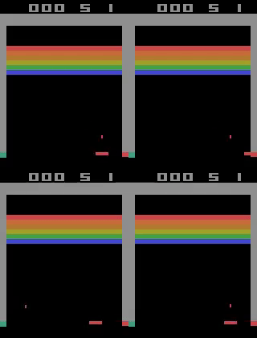
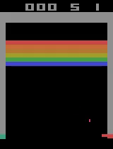

#A2C Reinforcement Learning with Atari Breakout-v5 

This project demonstrates the training of the Advantage Actor-Critic (A2C) reinforcement learning algorithm to play the classic Atari game **Breakout-v5** using OpenAI's Gym environment. The trained agent successfully learns to control the paddle and win the game by breaking bricks.

---

### 🎮 **Demo**
Here are two demonstration videos showcasing the performance of the trained agent:

1. **before training** Random sample play.
   - 

2. **Performance after training**  
   - 

---

### 🔧 **Environment Details**
- **Environment:** [Breakout-v5](https://ale.farama.org/environments/breakout/)  
- **Frameworks:** 
  - OpenAI Gym
  - PyTorch
  - Stable-Baselines3 (A2C implementation)  

---

### 🧠 **Reinforcement Learning Algorithm**
**A2C (Advantage Actor-Critic)** is a policy-gradient algorithm that improves training stability by using an advantage function. It updates both the policy (actor) and value (critic) networks simultaneously, reducing high variance common in vanilla policy gradients.

---

### 🚀 **How to Run**

1. **Clone this repository:**
   ```bash
   git clone https://github.com/Prithvijai/Atari_RL.git
   cd Atari_RL
   ```
---


### ⚙️ **Dependencies**
- Python 3.8+
- OpenAI Gym
- Stable-Baselines3
- PyTorch

---

### 📈 **Future Work**
- Implement other RL algorithms (e.g., DQN, PPO) for performance comparison.
- Fine-tune hyperparameters for improved performance.
- Apply transfer learning to similar Atari games.

---


